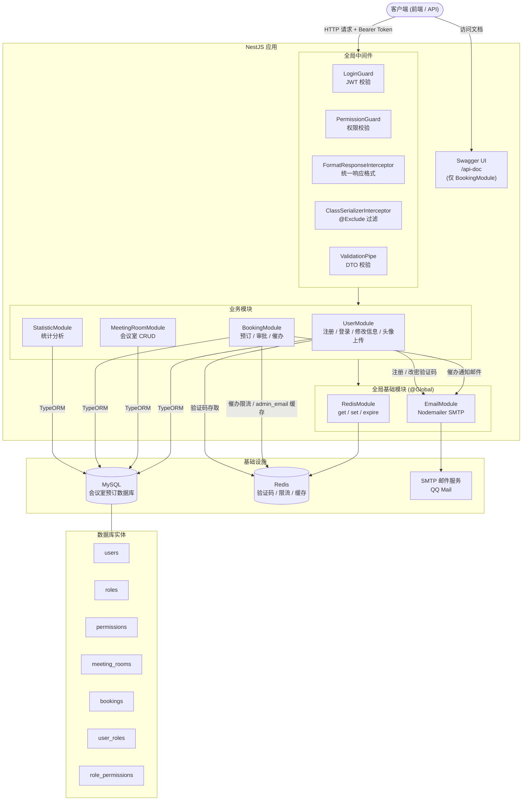

# 会议室订阅系统

## docker

```bash
docker compose build

docker compose up

#
docker compose down --rmi all

```

## 架构图


```mermaid
graph TB
    Client(["客户端 (前端 / API)"])

    subgraph NestJS["NestJS 应用"]
        direction TB

        subgraph GlobalMiddleware["全局中间件"]
            LG["LoginGuard\nJWT 校验"]
            PG["PermissionGuard\n权限校验"]
            FRI["FormatResponseInterceptor\n统一响应格式"]
            CSI["ClassSerializerInterceptor\n@Exclude 过滤"]
            VP["ValidationPipe\nDTO 校验"]
        end

        subgraph Modules["业务模块"]
            UM["UserModule\n注册 / 登录 / 修改信息 / 头像上传"]
            MRM["MeetingRoomModule\n会议室 CRUD"]
            BM["BookingModule\n预订 / 审批 / 催办"]
            SM["StatisticModule\n统计分析"]
        end

        subgraph GlobalModules["全局基础模块 (@Global)"]
            RM["RedisModule\nget / set / expire"]
            EM["EmailModule\nNodemailer SMTP"]
        end

        Swagger["Swagger UI\n/api-doc\n(仅 BookingModule)"]
    end

    subgraph Infra["基础设施"]
        MySQL[("MySQL\n会议室预订数据库")]
        Redis[("Redis\n验证码 / 限流 / 缓存")]
        SMTP["SMTP 邮件服务\nQQ Mail"]
    end

    subgraph DB_Tables["数据库实体"]
        direction LR
        T1["users"]
        T2["roles"]
        T3["permissions"]
        T4["meeting_rooms"]
        T5["bookings"]
        T6["user_roles"]
        T7["role_permissions"]
    end

    Client -->|"HTTP 请求 + Bearer Token"| GlobalMiddleware
    GlobalMiddleware --> Modules
    Modules --> GlobalModules

    UM -->|TypeORM| MySQL
    MRM -->|TypeORM| MySQL
    BM -->|TypeORM| MySQL
    SM -->|TypeORM| MySQL

    RM --> Redis
    BM -->|"催办限流 / admin_email 缓存"| Redis
    UM -->|"验证码存取"| Redis

    EM --> SMTP
    BM -->|"催办通知邮件"| EM
    UM -->|"注册 / 改密验证码"| EM

    MySQL --- DB_Tables
    Client -->|"访问文档"| Swagger
```
